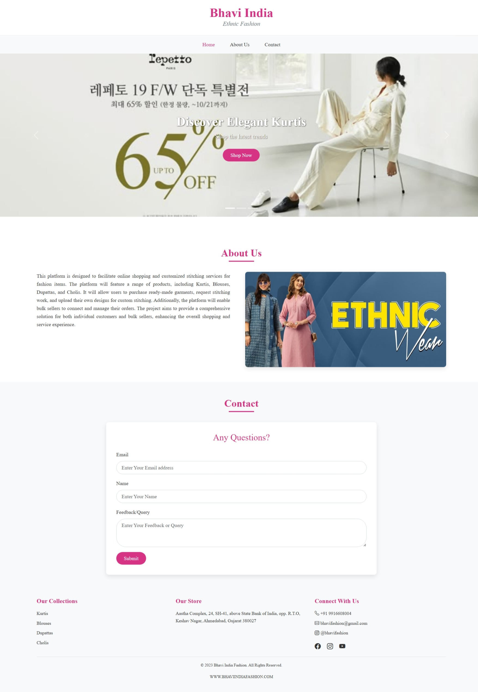

# Fashion Static Site

A simple static website built with HTML and CSS for a fashion brand, offering online shopping and custom stitching services for items like Kurtis, Blouses, Dupattas, and Cholis.

## Features

- **Interactive Carousel**: Showcases featured collections with elegant animations
- **Product Categories**: Kurtis, Blouses, Dupattas, and Cholis collections
- **Custom Stitching**: Option to request custom designs
- **Bulk Orders**: Special section for sellers
- **Responsive Design**: Works perfectly on all devices
- **Contact Form**: For customer inquiries

## Screenshots


## Technologies Used

- **Frontend**:
  - HTML5
  - CSS3 (Flexbox, Grid, Animations)
  - Bootstrap 5.3.3 (Responsive Framework)
  - Bootstrap Icons

- **Development Tools**:
  - Git & GitHub (Version Control)
  - Visual Studio Code (IDE)

## How to Run Locally

1. Clone the repository:
   ```bash
   git clone https://github.com/shrushtiprograms/fashion-static-site.git
   cd fashion-static-site
